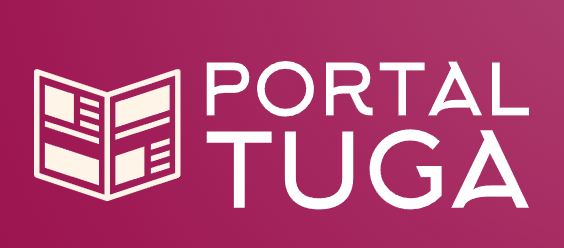

# Project: Portal Tuga

## Project Overview

**Portal Tuga** is a web-based platform designed to provide users with up-to-date news articles from various sources. Users can select their preferred news sources and customize their news feed. The application gathers data periodically from news pages' RSS feeds and JSON:APIs and presents this information to users based on their selected sources.

The news can be gathered from curated and public-available JSON APIs and RSS feeds from this link: https://github.com/rgllm/awesome-portugal-data.

## Project Components

### 1. Data Collection

- **RSS feeds**: The application periodically fetches news articles from various RSS feeds. For example, it collects articles from "news_source_1.com/rss" and "news_source_2.com/rss."
- **JSON:APIs**: In addition to RSS feeds, the application retrieves data from JSON:APIs. For example, it may use the JSON:API of "news_source_3.com/api/latest."
- **Data processing**: The gathered data is processed to extract relevant information such as headlines, article content, publication dates, and source details.
- **Checking for few articles**: The backend regularly checks for new articles by comparing the fetched data with the previously stored articles. If new articles are found, they are added to the database.

### 2. Backend

- **Django**: The backend of the application is developed using Django. It handles data retrieval, processing, and storage.
- **Database (PostgreSQL)**: PostgreSQL is used to store news articles, user preferences, and other application-related data.
- **Data Caching (Redis)**: Redis is employed for caching frequently accessed news articles and reducing the load on the database.

### 3. Frontend

- **React or Vue.js**: The frontend is developed using a modern JavaScript library or framework like React or Vue.js. It allows users to customize their news feed, view articles, and manage their preferences. The framework to be used is still being reviewed.
- **User Authentication**: Users can create accounts, log in, and personalize their news sources. User authentication is implemented using an Identity Provider, such as Keycloak.
- **Cross-Origin Resource Sharing (CORS)**: CORS headers are set up to enable secure communication between the frontend and backend.

### 4. Cloud Infrastructure

- **Google Cloud Platform (GCP)**: GCP is chosen as the cloud provider to host the application's infrastructure. It offers scalability, reliability, and a range of cloud services.
- **Terraform**: Terraform is used to provision cloud resources, including virtual machines, databases, and storage services.
- **Ansible**: Ansible is employed for configuration management and ensuring that the infrastructure remains in the desired state.
- **Kubernetes**: Kubernetes orchestrates the containerized application components, ensuring high availability, scalability, and easy management.
- **Helm Charts**: Helm charts are created to simplify the deployment and scaling of application components.

### 5. CI/CD Pipeline

- **Continuous Integration**: The project includes a CI/CD pipeline that automates continuous integration and testing. For example, unit tests ensure code quality and reliability.
- **Continuous Deployment**: The pipeline deploys new versions of the application when changes are pushed to the version control repository (GitHub).

### 6. Monitoring and Alerts

- **Prometheus and Grafana**: The application is monitored using Prometheus for data collection and Grafana for visualization. Various metrics, such as user activity and application performance, are tracked.
- **Alerts**: Alerts are set up to notify administrators in case of critical events, such as server resource exhaustion or application errors.

### 7. HTTPS Nginx Load Balancer

- **Nginx**: Nginx is configured as an HTTPS load balancer to ensure secure access and even distribution of user requests.
- **TLS Certificates**: TLS certificates are used to encrypt data in transit, enhancing security.

### 8. Log Management

- **ELK Stack (Elasticsearch, Logstash, Kibana)**: Logs generated by the application are collected and analyzed using the ELK Stack. This helps in identifying issues and monitoring system behavior.

### 9. Data Processing with Kafka

- **Apache Kafka**: Kafka is used as a message queue to collect and process data efficiently from RSS feeds and JSON:APIs.

------

## Learning Objectives

The idea for the Portal Tuga's project was solely conceptualized and developed to implement several key technologies for the DevOps methodology, so I could learn (or improve) the previously mentioned technologies and improve my overall:

- **DevOps Skills**: Hands-on experience in setting up a complete DevOps pipeline. As I will work on infrastructure provisioning, configuration management, containerization, continuous integration, continuous deployment, monitoring, and data processing.
- **Cloud Expertise**: You'll become proficient in using Google Cloud Platform and Terraform for cloud resource management.
- **Container Orchestration**: Kubernetes and Helm charts will help you understand container orchestration and deployment.
- **CI/CD Pipelines**: You'll develop a robust CI/CD pipeline, integrating automated testing and deployment.
- **Monitoring and Alerts**: Learn to monitor applications and set up alerts for critical events.
- **Security**: Implement secure practices, including HTTPS, TLS certificates, user authentication, and log management.
- **Data Processing**: Gain experience in efficiently processing data from various sources using Apache Kafka.

------

## Proposed architecture and used technologies:

